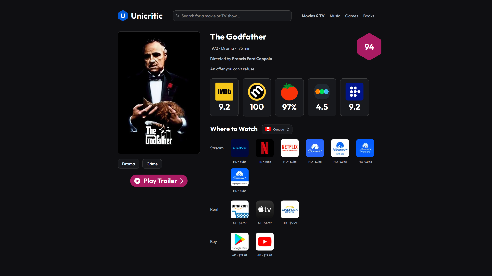

# 🎬 Unicritic

Unicritic is a **Next.js web application** that aggregates ratings and reviews from **multiple platforms** - including IMDb, Rotten Tomatoes, Letterboxd, and others - into a single unified score called the **“Uniscore.”**  

The app lets users quickly see how a movie or TV show is received across different review sources, along with streaming availability, trailers, and direct links to each platform.



---

## 🌟 Features

- 📊 **Unified Rating System (Uniscore):** Combines ratings from various platforms into one weighted average  
- 🔍 **Cross-Platform Aggregation:** Gathers data from IMDb, Rotten Tomatoes, Letterboxd, and more using web scraping and private APIs  
- 🌍 **Streaming Availability:** Displays where to stream content by country via the JustWatch API wrapper  
- 🎥 **Interactive Experience:** Includes trailers, review links, and streaming site redirects  
- ⚡ **Optimized Data Fetching:** Built with SWR and Axios for fast, cache-friendly performance  
- 📱 **Responsive Design:** Clean, adaptive layout for both desktop and mobile users  

---

## 🧠 Inspiration

Finding consistent movie ratings across platforms is tedious - some prefer IMDb, others use Rotten Tomatoes, and newer users follow Letterboxd or MUBI.  

**Unicritic** solves this by merging all sources into a single score and clean interface, helping users decide what to watch without platform-hopping.

---

## 🏗️ Tech Stack

**Frontend:** Next.js, React, Tailwind CSS  
**Data Handling:** Axios, SWR, Cheerio (for scraping)  
**APIs:** TMDb API, JustWatch API (Node.js wrapper)  
**Other Tools:** Node.js, Vercel (hosting)

---

## ⚙️ Setup & Installation

1. **Clone the repository**
   ```bash
   git clone https://github.com/FarhaanAli05/unicritic.git
   cd unicritic

2. **Install dependencies**
   ```bash
   npm install

3. **Create a .env.local file in the root directory and add your API keys:**
   ```bash
   TMDB_API_KEY=your_tmdb_key_here

4. Run the development server
   ```bash
   npm run dev

5. **Visit http://localhost:3000 to explore Unicritic locally.**

---

## 📚 Future Enhancements

- Extend Unicritic beyond movies and TV shows to include **music, games, and books**, each with their own unified “Uniscore”
- Implement a **database layer** for caching, user profiles, and saved favorites
- Add a **main dashboard** showcasing trending and top-rated content across all categories
- Introduce a **Unicritic Top 250 page** highlighting the highest-rated movies based on aggregated scores
- Explore advanced **filtering and search features** (by genre, platform, or region) for deeper content discovery

---

## 🤝 Contributing

Pull requests and suggestions are welcome!

If you would like to contribute a feature or fix a bug:
1. Fork the repo
2. Create a new branch (```git checkout -b feature-name```)
3. Commit changes and open a PR

---

## 🧑‍💻 Author

**Farhaan Ali**

Computing @ Queen’s University

[LinkedIn](https://www.linkedin.com/in/farhaan-ali/) · [Portfolio (coming soon)](#) · [GitHub](https://github.com/FarhaanAli05)
